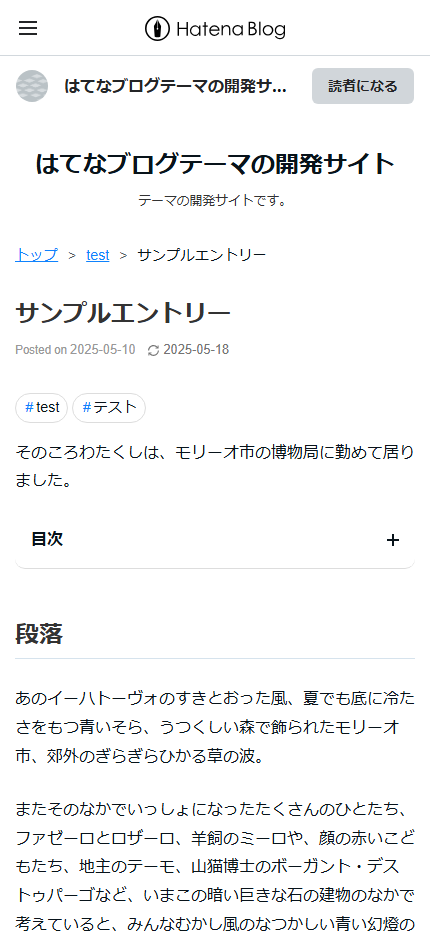
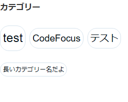
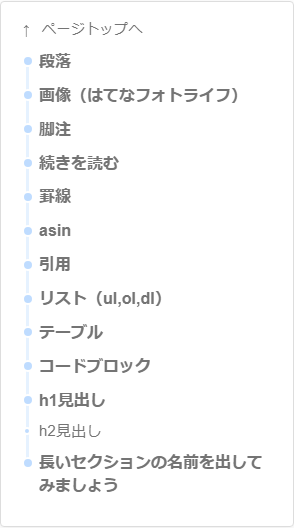
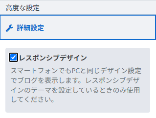
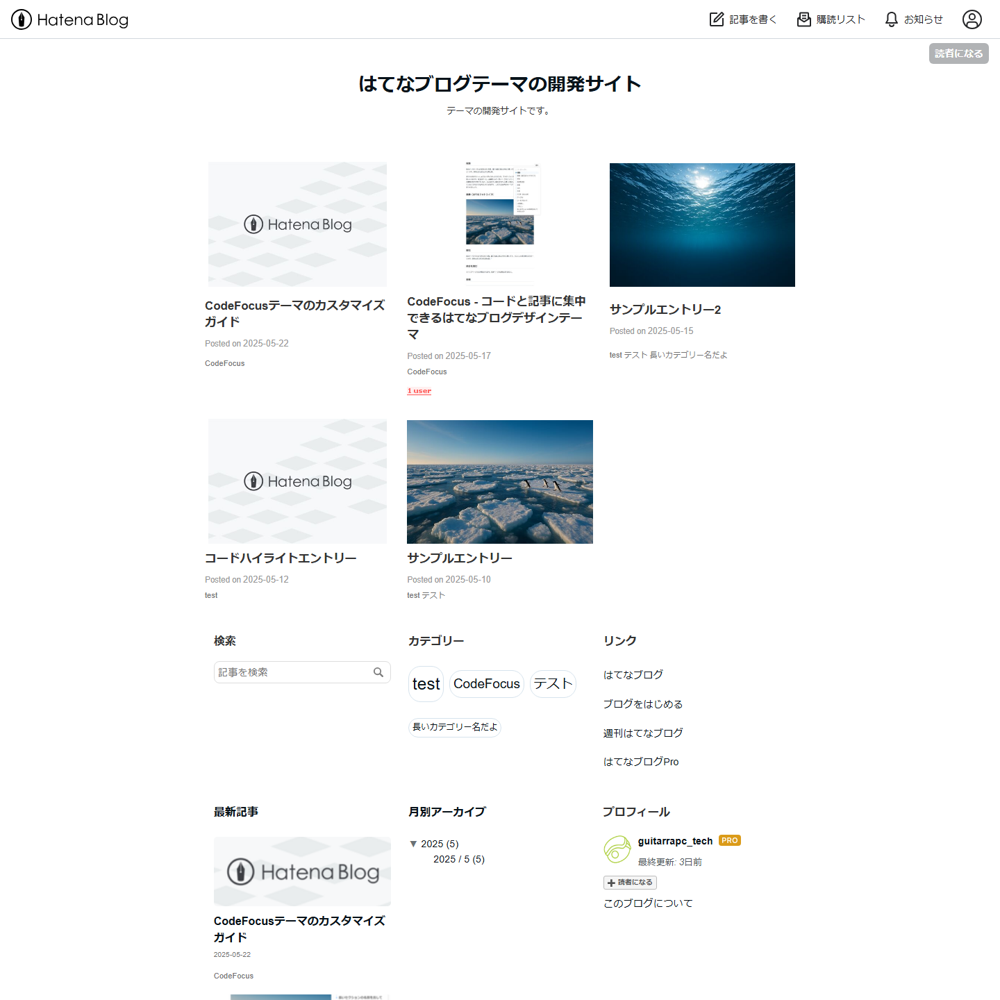
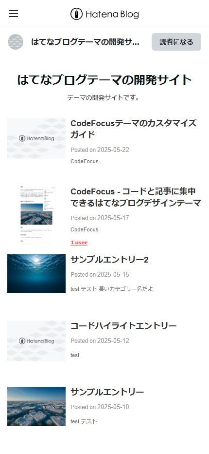
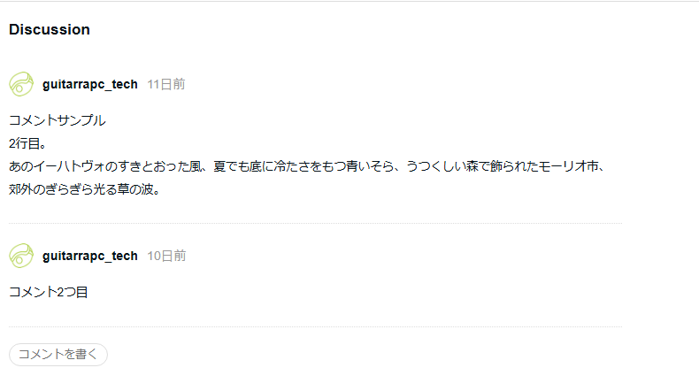
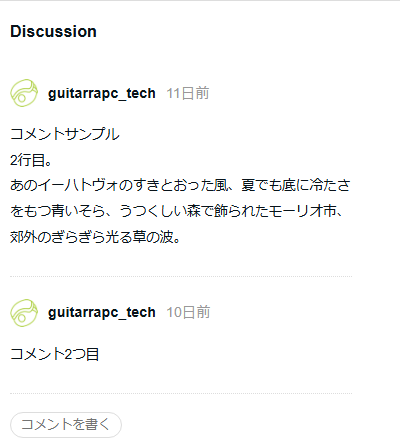

# CodeFocus - コードと記事に集中できるはてなブログデザインテーマ

はてなブログをもっとシンプルに、もっと読みやすく。CodeFocusテーマは、[Zenn](https://zenn.dev/)スタイルからインスピレーションを得た、プログラミングブログに最適なシングルカラムデザインのはてなブログテーマです。

[:contents]

## テーマの特徴

CodeFocusテーマは、以下の特徴を持つ現代的なデザインテーマです：

- **シンプルなシングルカラムレイアウト** - コンテンツに集中できる余白と配置を重視したデザイン
- **美しいコードハイライト** - プログラミング記事に最適な読みやすいコード表示
- **便利な目次機能** - 記事内の目次とフローティング目次の両方をサポート
- **完全レスポンシブデザイン** - PC、タブレット、スマートフォンすべてで最適表示
- **タグクラウドスタイル** - カテゴリーを記事数に応じて視覚的に分類
- **Zenn風コメントデザイン** - スッキリと読みやすいディスカッション表示

## デザインと見た目

CodeFocusテーマは、すべてのデバイスで美しく表示されるよう設計されています。

CodeFocusテーマは複数のデバイスサイズに最適化されており、それぞれのデバイスで読みやすく美しい表示を実現しています。

### デバイス別の記事表示

各デバイスでの表示の違いを以下に示します。PCでは十分な余白を持ったレイアウト、タブレットではタッチ操作に適したサイズ調整、スマートフォンでは限られた画面サイズを最大限に活用するレイアウトになっています。

| PC表示 | タブレット表示 | スマートフォン表示 |
| --- | --- | --- |
|  |  |  |

PCでは、コンテンツを中心に配置し、サイドバーが下部に移動することで、記事本文に集中できる環境を提供します。タブレットとスマートフォンでは、デバイスの特性に合わせて余白やフォントサイズが自動調整され、それぞれのデバイスに最適化された読みやすさを実現しています。

## コードハイライトとタグクラウド

CodeFocusテーマはプログラミング記事に最適なスタイルを提供します。

### コードハイライト表示

プログラミング言語のコードブロックを見やすく表示します。複数言語に対応し、長いコードでも読みやすいデザインです。

以下は、Python、C#、Goで同一処理を記述したコードの表示例です：

Pythonコードハイライト

```python
#!/usr/bin/env python3
from dataclasses import dataclass
from typing import List

# 2-D immutable point
@dataclass(frozen=True)
class Point:
    x: float; y: float
    def __add__(self, o: "Point") -> "Point":
        return Point(self.x + o.x, self.y + o.y)

def sum_points(ps: List[Point]) -> Point:
    total = Point(0, 0)
    for p in ps:
        total += p
    return total

if __name__ == "__main__":
    pts = [Point(i, (i * i) % 5) for i in range(5)]
    print(sum_points(pts))
```

C#コードハイライト

```cs
using System;
using System.Collections.Generic;
using System.Linq;

var points = Enumerable.Range(0, 5)
    .Select(i => new Point(i, (i * i) % 5));
Console.WriteLine($"Total = {Sum(points)}");

static Point Sum(IEnumerable<Point> pts)
    => pts.Aggregate(new Point(0, 0), (acc, p) => acc + p);

// immutable value object
public readonly record struct Point(double X, double Y)
{
    public static Point operator +(Point a, Point b) => new(a.X + b.X, a.Y + b.Y);
}
```

Goコードハイライト

```go
package main

import "fmt"

// Point is a simple 2-D vector
type Point struct{ X, Y int }

func (p Point) Add(o Point) Point { return Point{p.X + o.X, p.Y + o.Y} }

func Sum(ps []Point) (t Point) {
	for _, p := range ps { t = t.Add(p) }
	return
}

func main() {
	pts := make([]Point, 5)
	for i := range pts { pts[i] = Point{i, (i * i) % 5} }
	fmt.Printf("Total = %+v\n", Sum(pts))
}
```

### タグクラウドスタイル

タグクラウド風の表示でカテゴリーを記事数に応じて視覚的に表示します。記事数が多いカテゴリーほど大きく表示されるため、ブログの主要テーマが一目でわかります。サイドバーのカテゴリーモジュールは、タグクラウドスタイルになっており、記事数に応じてフォントサイズが自動調整されます。

具体的な記事数に応じた表示は以下のようになっています：

- **1～5記事**: 小さめのフォント (0.8em)
- **6～10記事**: やや小さめのフォント (0.9em)
- **11～20記事**: 標準サイズ (1em)
- **21～50記事**: やや大きめのフォント (1.1～1.2em)、太字
- **51記事以上**: 大きめのフォント (1.3em)、太字



## 便利な目次機能

CodeFocusテーマでは、2種類の目次表示方法を提供しています：

### 1. 記事内目次

※ テーマ導入後、後述するJavaScriptの設定が必要です。

記事の`[:contents]`で生成される目次をスタイリングしました。タイトル部分をクリックすることで開閉可能な目次は、長い記事でも読者が迷わずに読み進められるようサポートします。


### 2. フローティング目次ボタン

※ テーマ導入後、後述するJavaScriptの設定が必要です。

記事右上に常に表示される目次ボタンを提供します。このボタンをクリックすると、いつでも目次を表示できるため、長い記事でも迷子になることがありません。目次ボタンは、ページトップから少しスクロールすると表示されます。


目次スタイルはシンプルでありながらも機能的です。



## テーマの導入方法

はてなブログのテーマストアか、GitHubから直接ダウンロードして導入できます。

### テーマストアからの導入

1. [テーマストア](https://blog.hatena.ne.jp/-/store/theme/)から、「CodeFocus」を選択
2. 自分のブログにインストール

### GitHubからの導入

1. [HatenaBlog-Theme](https://github.com/guitarrapc/HatenaBlog-Theme) リポジトリから最新版の `style.css` をダウンロード
2. はてなブログの管理画面から「デザイン設定」→「カスタマイズ」→「デザインCSS」にCSSをコピー＆ペースト
3. 「保存」ボタンをクリックしてテーマを適用

## テーマ導入後の設定

### レスポンシブデザイン設定

CodeFocusテーマはレスポンシブデザインに完全対応していますが、正しく表示するには以下の設定が必要です：

1. はてなブログの管理画面から「デザイン設定」→「スマートフォン」に進む
2. 「詳細設定」のセクションで「レスポンシブデザインを適用する」にチェック
3. 変更を保存



### 目次開閉機能を利用する

記事中の目次を開閉する機能を使用するには、以下の設定を行ってください：

1. [toc-toggle.html](https://github.com/guitarrapc/HatenaBlog-Theme/blob/master/toc-toggle.html) ファイルの内容をコピー
2. はてなブログの管理画面から「詳細設定」→「`<head>要素にメタデータを追加`」に貼り付け
3. 変更を保存

### 目次ボタン機能を利用する

ページ右上に固定される目次ボタンを使用するには、以下の設定を行ってください：

1. [toc-button.html](https://github.com/guitarrapc/HatenaBlog-Theme/blob/master/toc-button.html) ファイルの内容をコピー
2. はてなブログの管理画面から「詳細設定」→「`<head>要素にメタデータを追加`」に貼り付け
3. 変更を保存

### はてなブログPro契約者向け設定

はてなブログProをご利用の方は、以下の設定をおすすめします：

1. 「設定」→「詳細設定」でヘッダーとフッターを非表示に設定
2. 「デザイン」→「カスタマイズ」→「レイアウト」で「トップページを一覧形式にする」を選択
3. 変更を保存

トップページを一覧形式に設定することで、CodeFocusテーマの美しいアーカイブ表示を活用できます。いくつかの記事を一覧で表示することで、読者は興味のある記事にすぐにアクセスできます。

| PC表示 | タブレット表示 | スマートフォン表示 |
| --- | --- | --- |
|  |  |  |

## カスタマイズ方法

CodeFocusテーマは、カスタマイズしやすい構造になっています。CSSの知識があれば、以下のような部分を簡単にカスタマイズできます：

### 色の変更

```css
:root {
  --primary-color: #3366ff; /* メインカラー */
  --text-color: #333333; /* 文字色 */
  --link-color: #0066cc; /* リンク色 */
  --background-color: #ffffff; /* 背景色 */
}
```

### フォントの変更

```css
body {
  font-family: 'Helvetica Neue', Arial, 'Hiragino Kaku Gothic ProN', 'Hiragino Sans', Meiryo, sans-serif;
}
```

### 目次スタイルのカスタマイズ

```css
.table-of-contents {
  border-radius: 8px;
  background-color: #f8f9fa;
}
```

### カテゴリーの表示スタイル変更

記事内のカテゴリーは丸みを帯びたタグスタイルで表示されます。ホバー時の挙動も設定可能です。

```css
.entry-categories .entry-category-link {
  border-radius: 16px;
  padding: 3px 10px;
}
```

通常表示:


ホバー時:


### タグクラウドのカスタマイズ

サイドバーのカテゴリーモジュールはタグクラウドスタイルで表示されます。記事数に応じたフォントサイズの変化やホバー効果をカスタマイズできます。

```css
/* タグクラウドのベーススタイル */
.hatena-module-category .hatena-urllist li a {
  display: inline-block;
  padding: 0.3em 0.6em;
  border-radius: 20px;
  text-decoration: none;
  border: 1px solid #e6e6e6; /* --border-light変数の値 */
  transition: all 0.2s ease;
}

/* 記事数による大きさの調整 */
/* 1-5記事 (小) */
.hatena-module-category .hatena-urllist li a[href*="(1)"],
.hatena-module-category .hatena-urllist li a[href*="(2)"],
.hatena-module-category .hatena-urllist li a[href*="(3)"],
.hatena-module-category .hatena-urllist li a[href*="(4)"],
.hatena-module-category .hatena-urllist li a[href*="(5)"] {
  font-size: 0.8em;
}

/* 6-10記事 (やや小) */
.hatena-module-category .hatena-urllist li a[href*="(6)"],
.hatena-module-category .hatena-urllist li a[href*="(7)"],
.hatena-module-category .hatena-urllist li a[href*="(8)"],
.hatena-module-category .hatena-urllist li a[href*="(9)"],
.hatena-module-category .hatena-urllist li a[href*="(10)"] {
  font-size: 0.9em;
}

/* 11-20記事 (標準) */
.hatena-module-category .hatena-urllist li a[href*="(11)"],
.hatena-module-category .hatena-urllist li a[href*="(12)"],
.hatena-module-category .hatena-urllist li a[href*="(13)"],
.hatena-module-category .hatena-urllist li a[href*="(14)"],
.hatena-module-category .hatena-urllist li a[href*="(15)"],
.hatena-module-category .hatena-urllist li a[href*="(16)"],
.hatena-module-category .hatena-urllist li a[href*="(17)"],
.hatena-module-category .hatena-urllist li a[href*="(18)"],
.hatena-module-category .hatena-urllist li a[href*="(19)"],
.hatena-module-category .hatena-urllist li a[href*="(20)"] {
  font-size: 1em;
}

/* 21-50記事 (やや大) */
.hatena-module-category .hatena-urllist li a[href*="(2"][href$=")"],
.hatena-module-category .hatena-urllist li a[href*="(3"][href$=")"],
.hatena-module-category .hatena-urllist li a[href*="(4"][href$=")"] {
  font-size: 1.1em;
  font-weight: bold;
}

/* 21-50記事のうち、2桁以上の記事数 (除外条件付き) */
.hatena-module-category .hatena-urllist li a[href*="(2"][href$=")"]:not([href*="(2)"]),
.hatena-module-category .hatena-urllist li a[href*="(3"][href$=")"]:not([href*="(3)"]),
.hatena-module-category .hatena-urllist li a[href*="(4"][href$=")"]:not([href*="(4)"]) {
  font-size: 1.2em;
}

/* 51記事以上 (大) */
.hatena-module-category .hatena-urllist li a[href*="(5"][href$=")"]:not([href*="(5)"]),
.hatena-module-category .hatena-urllist li a[href*="(6"][href$=")"]:not([href*="(6)"]),
.hatena-module-category .hatena-urllist li a[href*="(7"][href$=")"]:not([href*="(7)"]),
.hatena-module-category .hatena-urllist li a[href*="(8"][href$=")"]:not([href*="(8)"]),
.hatena-module-category .hatena-urllist li a[href*="(9"][href$=")"]:not([href*="(9)"]) {
  font-size: 1.3em;
  font-weight: bold;
}

/* ホバー効果 */
.hatena-module-category .hatena-urllist li a:hover {
  background-color: #f0f7ff; /* --btn-hover変数の値 */
  box-shadow: 0 2px 3px rgba(0, 0, 0, 0.1);
}
```

### コメントセクションのカスタマイズ

CodeFocusテーマでは、コメントセクションもZennのDiscussionスタイルに似たデザインになっています。ユーザー名や日付が見やすく配置され、コメント内容も読みやすくレイアウトされています。

| PC表示 | タブレット表示 | スマートフォン表示 |
| --- | --- | --- |
|  |  |  |

より高度なカスタマイズをしたい方は、[GitHub リポジトリ](https://github.com/guitarrapc/HatenaBlog-Theme)からSCSSファイルをダウンロードして、ローカルで開発することもできます。

## 開発者向け情報

テーマをさらにカスタマイズしたい開発者の方々へ、CodeFocusテーマは以下のような構造でSCSSファイルが分割されています：

- `_variable.scss` - カラーやフォントなどの変数定義
- `_core.scss` - 全体のベーススタイル
- `_table_of_contents.scss` - 記事内目次のスタイル
- `_table_of_contents_toggle.scss` - 目次開閉機能のスタイル
- `_table_of_contents_button.scss` - 目次ボタンのスタイル
- `_related_entries.scss` - 関連記事のスタイル
- `_functions.scss` - SCSSで使用する関数定義

この構造により、特定の部分だけを変更したい場合も簡単に対応できます。

### ローカル開発環境の構築

開発環境を構築することで、リアルタイムで変更を確認しながらテーマをカスタマイズできます：

```bash
# リポジトリのクローン
git clone https://github.com/guitarrapc/HatenaBlog-Theme.git
cd HatenaBlog-Theme

# 必要なモジュールをインストール
npm install

# 開発サーバーの起動（ブログドメイン名を指定）
npm start -- your-blog.hatenablog.com
```

これにより、SCSSの変更がリアルタイムでブログに反映され、即座に効果を確認できます。

## 関連記事の表示

CodeFocusテーマでは、関連記事もレイアウトされています。サムネイル画像とタイトル、日付が見やすく配置されており、読者が関連コンテンツを探しやすくなっています。


## まとめ

CodeFocusテーマは、美しく読みやすいブログを簡単に実現できる、モダンなはてなブログテーマです。特にプログラミングやコード記事を書くブロガーにおすすめのデザインで、コンテンツの表示を最適化しています。

シンプルなデザインながらも必要な機能をすべて備えており、ブログ執筆に集中できる環境を提供します。レスポンシブデザインにより、あらゆるデバイスからの閲覧にも対応しています。

ぜひあなたのブログに取り入れて、読者に快適な読書体験を提供してください！

---

*CodeFocusテーマに関するフィードバックやご質問は、[GitHub Issues](https://github.com/guitarrapc/HatenaBlog-Theme/issues)にてお待ちしております。*
